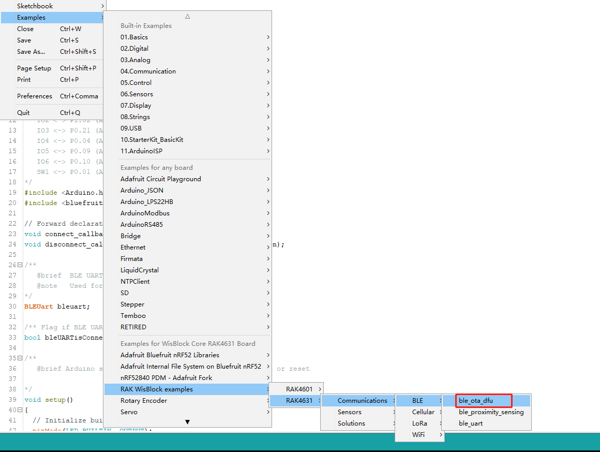
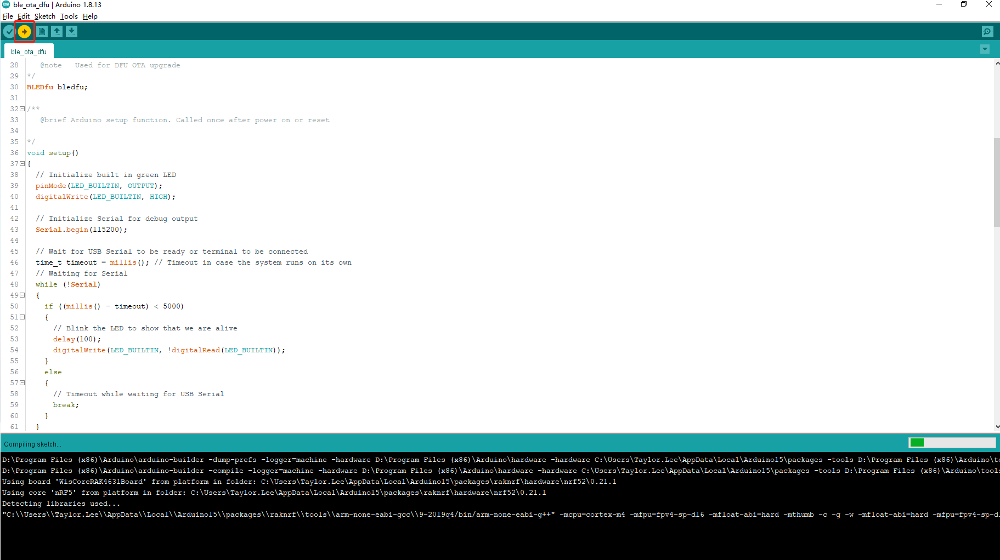
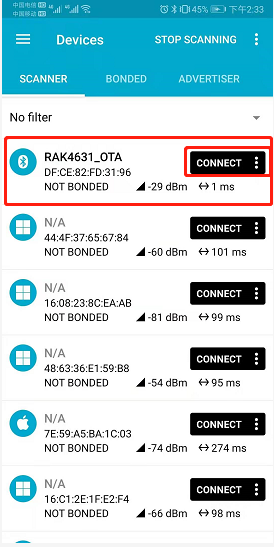
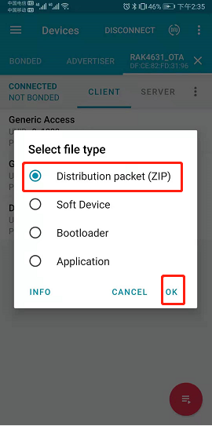
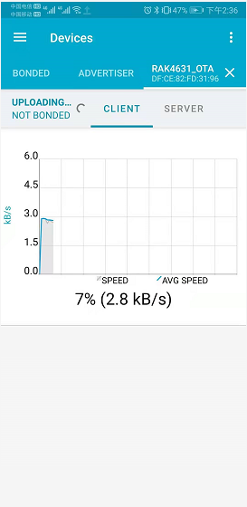

# Upgrade new bootloader with BLE OTA DFU to RAK4631

This document is about using BLE OTA DFU to upgrade bootloader. 

If you want to use jFlash to burn firmware, please select the [specified firmware](./RAK4630_bootloader-0.4.1.hex) and do follow the instructions given [here](../README.md).

## Requirements

- [Firmware upgrade Zip package](./RAK4630_bootloader-0.4.1.zip)
- [nRF Connect for Mobile](https://www.nordicsemi.com/Software-and-tools/Development-Tools/nRF-Connect-for-mobile)
- RAK4631 + RAK5005 +USB Cable + BLE antenna

	

# IMPORTANT - READ FIRST
To be able to use BLE OTA DFU you must have a sketch running on the RAK4631 that supports OTA DFU. Please follow the instruction in [Upgrade](#upgrade) and install first the **`ble_ota_dfu`** sketch! Without this sketch it is _**NOT**_ possible to upgrade your bootloader over BLE!  
  
_**After you flashed the new bootloader, any existing Arduino sketch on the RAK4631 will be erased and you need to flash your application again!**_

## Upgrade

1. Choose example of BLE OTA DFU

2. Burn the example to RAK4631

   

3. Open nRF Connect for Mobile and connect the BLE named "RAK4631_OTA"

   	

   4. Click DFU button and select the upgrade Zip package.

      		

   5. After selecting upgrade package, upgrade starts, we wait until 100% is finished, and the upgrade is complete. If there is power failure or upgrade failure, please follow the previous steps again.

      	

   6. Now that the upgrade is successful, we can use Arduino to download the application.

