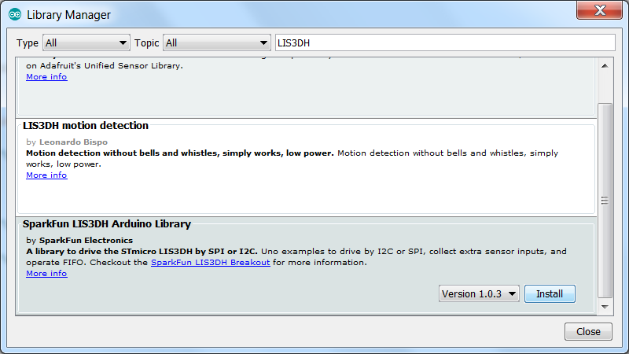

# WisBlock Sensor RAK1904 Accelerometer board Programming Guide

[TOC]

## 1 Introduction

This guide shows how to use the WisBlock Sensor RAK1904 Accelerometer board and how to program with it.

The information obtained from the accelerometer will then be printed over the USB debug port of the WisBlock Base board.

## 2 Hardware


### 2.1 FEATURES

- Wide supply voltage, 1.71 V to 3.6 V
- Ultra-low-power mode consumption down to 2 μA
- ±2g/±4g/±8g/±16g dynamically selectable full scale
- I2C digital output interface
- 16-bit data output
- 2 independent programmable interrupt generators for free-fall and motion detection
- 6D/4D orientation detection
- Free-fall detection
- Motion detection
- Embedded temperature sensor
- Embedded self-test
- Embedded 32 levels of 16-bit data output FIFO
- 10000 g high shock survivability

### 2.2 Hardware required

To build this system the WisBlock Core RAK4631 microcontroller is using the RAK1904 3-Axis accelerometer module. With just two WisBlock board plugged into the WisBlock Base RAK5005-O board the system is ready to be used.

- WisBlock Base RAK5005-O
- WisBlock Core RAK4631
- WisBlock Sensor RAK1904

### 2.2 How to install this module

This module can be installed on any one SLOT(A B C D) in WisBlock Base board RAK5005-O.

## 3 How to program based on Arduino

### 3.1 Software required

----

- [ArduinoIDE](https://www.arduino.cc/en/Main/Software)
- [RAK4630 BSP](https://github.com/RAKWireless/RAK-nRF52-Arduino)
- [LIS3DH library](https://github.com/sparkfun/SparkFun_LIS3DH_Arduino_Library)

### 3.2 Install SparkFun LIS3DH Arduino Library

We need to install this Arduino IDE library to control the LIS3DH on WisBlock Sensor RAK1904 board.

The Arduino Library Manager was added starting with Arduino IDE versions 1.5 and greater (1.6.x). It is found in the 'Sketch' menu under 'Include Library', 'Manage Libraries...'


When you open the Library Manager you will find a large list of libraries ready for one-click install. To find a library for your product, search for the product name or a keyword such as 'k type' or 'digitizer', and the library you want should show up. Click on the desired library, and the 'Install' button will appear. Click that button, and the library should install automatically. When installation finishes, close the Library Manager.



### 3.3 Initialization Setting Mode

> This module only supports I2C mode.

```c
{
	LIS3DH Sensor( I2C_MODE, 0x18 );	//Default constructor is I2C, addr 0x18.
    
    Sensor.settings.adcEnabled = 1;
    Sensor.settings.tempEnabled = 1;
    Sensor.settings.accelSampleRate = 50;  //Hz.  Can be: 0,1,10,25,50,100,200,400,1600,5000 Hz
    Sensor.settings.accelRange = 16;      //Max G force readable.  Can be: 2(default), 4, 8, 16
    Sensor.settings.xAccelEnabled = 1;
    Sensor.settings.yAccelEnabled = 1;
    Sensor.settings.zAccelEnabled = 1;
}
```

### 3.4 Setting Full-scale

Full-scale value can be setted when initializing the accelerometer

```c
{
	Sensor.settings.accelRange = 2;		//Max G force readable.  Can be: 2(default), 4, 8, 16
}
```

### 3.5 Setting work Mode

It sets the accelerometer’s work mode. It configures the accelerometer to a new work mode, where the possibilities are:

Normal mode: Output data rate 50 Hz 

Low power mode: Output data rate 1 Hz 

Low power mode: Output data rate 10 Hz 

Low power mode: Output data rate 25 Hz 

Low power mode: Output data rate 50 Hz 

Low power mode: Output data rate 100 Hz

Low power mode: Output data rate 200 Hz

Low power mode: Output data rate 400 Hz

Low power mode: Output data rate 1600 Hz

Low power mode: Output data rate 5000 Hz

```c
{
	Sensor.settings.accelSampleRate = 50;
}
```

### 3.6 start to work

```
{
	Sensor.begin()
}
```

### 3.7 Getting acceleration on axis

#### 3.7.1 Getting acceleration on axis X

The readFloatAccelX() function checks accelerometer’s acceleration on X axis. The value returned is defined in mG units.

```c
{
	Sensor.readFloatAccelX()
}	
```

#### 3.7.2 Getting acceleration on axis Y

The readFloatAccelY() function checks accelerometer’s acceleration on Y axis. The value returned is defined in mG units.

```
{
	Sensor.readFloatAccelY()
}
```

#### 3.7.3 Getting acceleration on axis Z

The readFloatAccelZ() function checks accelerometer’s acceleration on Z axis. The value returned is defined in mG units.

```
{
	Sensor.readFloatAccelZ()
}
```

## 4 Code examples

```
#include <SparkFunLIS3DH.h> 
#include <Wire.h>

LIS3DH SensorTwo( I2C_MODE, 0x18 );

void setup() {
    // Setup usb 
    Serial.begin(115200);
    while(!Serial);

    if( SensorTwo.begin() != 0 )
    {
    	Serial.println("Problem starting the sensor at 0x18.");
    }
    else
    {
    	Serial.println("Sensor at 0x18 started.");
    }
    Serial.println("enter !");
}

void loop() {
    lis3dh_get();
    delay(1000);
}

void lis3dh_get(){
    // read the sensor value
    uint8_t cnt = 0;

    Serial.print(" X(g) = ");
    Serial.println(SensorTwo.readFloatAccelX(), 4);
    Serial.print(" Y(g) = ");
    Serial.println(SensorTwo.readFloatAccelY(), 4);
    Serial.print(" Z(g)= ");
    Serial.println(SensorTwo.readFloatAccelZ(), 4);
}
```

**Results**

```
Sensor at 0x18 started.
enter !
 X(g) = 0.0230
 Y(g) = -0.5995
 Z(g)= 0.8187

 X(g) = 0.0310
 Y(g) = -0.5965
 Z(g)= 0.8057

 X(g) = 0.0250
 Y(g) = -0.5995
 Z(g)= 0.8087
```
