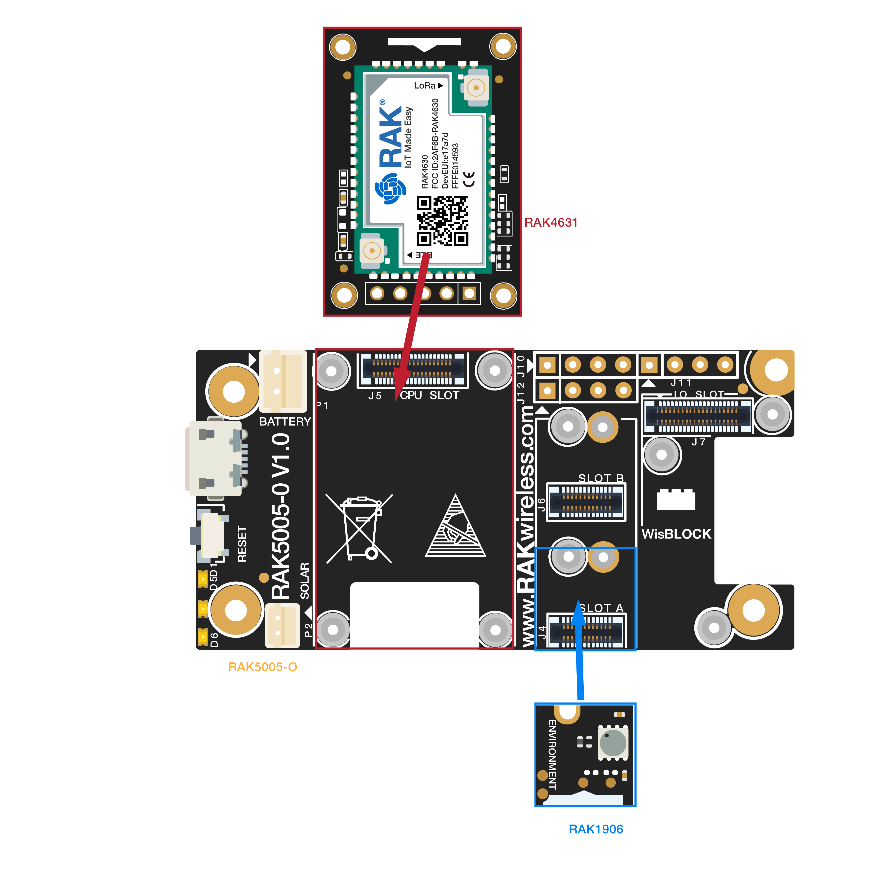
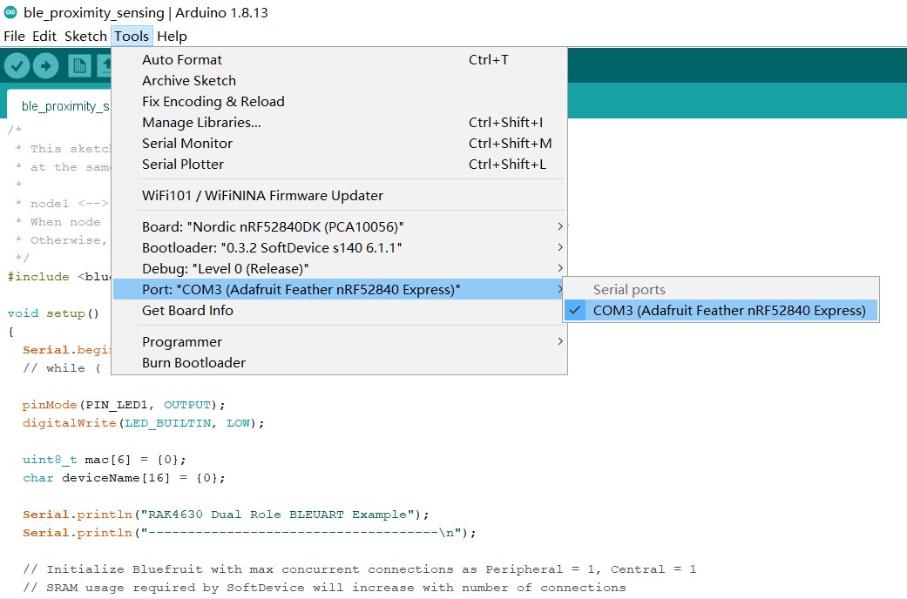

# WisBlock Sensor RAK1906 Environment board User Guide

This example shows how to use the WisBlock Sensor RAK1906 environment board.

The WisBlock Sensor RAK1906 environment board uses gas sensor BME680  which can measure relative humidity, barometric pressure, ambient temperature and gas (VOC).


Product physical map is as follows:


----
## Hardware required
----
To use the WisBlock Sensor RAK1906 environment board, The following hardware is required.

- WisBlock Base RAK5005-O  \*  1pcs
- WisBlock Core RAK4631      \*  1pcs
- WisBlock Sensor RAK1906          \*  1pcs


Hardware is shown as follows:



For stable connection, please use screws to tighten.

----
## Software required
----
To use the WisBlock Sensor RAK1906 environment board, The following software is required.

- [ArduinoIDE](https://www.arduino.cc/en/Main/Software)
- [RAK4630 BSP](https://github.com/RAKWireless/RAK-nRF52-Arduino)
- Adafruit BME680 Library


During the installation you will be asked to install the Adafruit Unified Sensor library. Please install it as well.


- BME680 BSEC Library


Connect the assembled hardware to the PC with a USB cable, open the Arduino, and select the development board and port in the tool menu.




## Demo

### Demo 1

The Demo is designed to get BME680 sensor data every 5 seconds and print the results on serial port.

```
#include <Wire.h>
#include <Adafruit_Sensor.h>
#include <Adafruit_BME680.h> // Click to install library: http://librarymanager/All#Adafruit_BME680

Adafruit_BME680 bme;
// Might need adjustments
#define SEALEVELPRESSURE_HPA (1010.0)

void bme680_init()
{
  Wire.begin();

  if (!bme.begin(0x76)) {
    Serial.println("Could not find a valid BME680 sensor, check wiring!");
    return;
  }

  // Set up oversampling and filter initialization
  bme.setTemperatureOversampling(BME680_OS_8X);
  bme.setHumidityOversampling(BME680_OS_2X);
  bme.setPressureOversampling(BME680_OS_4X);
  bme.setIIRFilterSize(BME680_FILTER_SIZE_3);
  bme.setGasHeater(320, 150); // 320*C for 150 ms
}

void bme680_get()
{
  Serial.print("Temperature = ");
  Serial.print(bme.temperature);
  Serial.println(" *C");

  Serial.print("Pressure = ");
  Serial.print(bme.pressure / 100.0);
  Serial.println(" hPa");

  Serial.print("Humidity = ");
  Serial.print(bme.humidity);
  Serial.println(" %");

  Serial.print("Gas = ");
  Serial.print(bme.gas_resistance / 1000.0);
  Serial.println(" KOhms");

  Serial.println();
}

void setup()
{
  // Initialize the built in LED
  pinMode(LED_BUILTIN, OUTPUT);
  digitalWrite(LED_BUILTIN, LOW);

  // Initialize Serial for debug output
  Serial.begin(115200);

  time_t serial_timeout = millis();
  // On nRF52840 the USB serial is not available immediately
  while (!Serial)
  {
    if ((millis() - serial_timeout) < 5000)
    {
      delay(100);
      digitalWrite(LED_BUILTIN, !digitalRead(LED_BUILTIN));
    }
    else
    {
      break;
    }
  }

  bme680_init();
}

void loop()
{
  if (! bme.performReading()) {
    Serial.println("Failed to perform reading :(");
    return;
  }
  bme680_get();
  delay(5000);
}

```


The test results are as follows：

```
Temperature = 30.66 *C
Pressure = 1013.80 hPa
Humidity = 44.38 %
Gas = 3.89 KOhms

Temperature = 30.69 *C
Pressure = 1013.78 hPa
Humidity = 44.59 %
Gas = 3.88 KOhms

Temperature = 30.72 *C
Pressure = 1013.82 hPa
Humidity = 44.37 %
Gas = 3.87 KOhms


```


### Demo 2

The Demo is from the examples of BME BSEC library, which is designed to get BME680 sensor data including IAQ. The sensor data will be printed on serial port in the order of "**Timestamp [ms], raw temperature [°C], pressure [hPa], raw relative humidity [%], gas [Ohm], IAQ, IAQ accuracy, temperature [°C], relative humidity [%], Static IAQ, CO2 equivalent, breath VOC equivalent**".

For example:

```
6625, 26.58, 95334.00, 67.13, 11561.00, 25.00, 0, 26.52, 67.17, 25.00, 500.00, 0.50
```

The Demo is as follows.

```
#include "bsec.h"

// Helper functions declarations
void checkIaqSensorStatus(void);
void errLeds(void);

// Create an object of the class Bsec
Bsec iaqSensor;

String output;

// Entry point for the example
void setup(void)
{
  Serial.begin(115200);
  while(!Serial) delay(10);
  Wire.begin();

  iaqSensor.begin(BME680_I2C_ADDR_PRIMARY, Wire);
  output = "\nBSEC library version " + String(iaqSensor.version.major) + "." + String(iaqSensor.version.minor) + "." + String(iaqSensor.version.major_bugfix) + "." + String(iaqSensor.version.minor_bugfix);
  Serial.println(output);
  checkIaqSensorStatus();

  bsec_virtual_sensor_t sensorList[10] = {
    BSEC_OUTPUT_RAW_TEMPERATURE,
    BSEC_OUTPUT_RAW_PRESSURE,
    BSEC_OUTPUT_RAW_HUMIDITY,
    BSEC_OUTPUT_RAW_GAS,
    BSEC_OUTPUT_IAQ,
    BSEC_OUTPUT_STATIC_IAQ,
    BSEC_OUTPUT_CO2_EQUIVALENT,
    BSEC_OUTPUT_BREATH_VOC_EQUIVALENT,
    BSEC_OUTPUT_SENSOR_HEAT_COMPENSATED_TEMPERATURE,
    BSEC_OUTPUT_SENSOR_HEAT_COMPENSATED_HUMIDITY,
  };

  iaqSensor.updateSubscription(sensorList, 10, BSEC_SAMPLE_RATE_LP);
  checkIaqSensorStatus();

  // Print the header
  output = "Timestamp [ms], raw temperature [°C], pressure [hPa], raw relative humidity [%], gas [Ohm], IAQ, IAQ accuracy, temperature [°C], relative humidity [%], Static IAQ, CO2 equivalent, breath VOC equivalent";
  Serial.println(output);
}

// Function that is looped forever
void loop(void)
{
  unsigned long time_trigger = millis();
  if (iaqSensor.run()) { // If new data is available
    output = String(time_trigger);
    output += ", " + String(iaqSensor.rawTemperature);
    output += ", " + String(iaqSensor.pressure);
    output += ", " + String(iaqSensor.rawHumidity);
    output += ", " + String(iaqSensor.gasResistance);
    output += ", " + String(iaqSensor.iaq);
    output += ", " + String(iaqSensor.iaqAccuracy);
    output += ", " + String(iaqSensor.temperature);
    output += ", " + String(iaqSensor.humidity);
    output += ", " + String(iaqSensor.staticIaq);
    output += ", " + String(iaqSensor.co2Equivalent);
    output += ", " + String(iaqSensor.breathVocEquivalent);
    Serial.println(output);
  } else {
    checkIaqSensorStatus();
  }
}

// Helper function definitions
void checkIaqSensorStatus(void)
{
  if (iaqSensor.status != BSEC_OK) {
    if (iaqSensor.status < BSEC_OK) {
      output = "BSEC error code : " + String(iaqSensor.status);
      Serial.println(output);
      for (;;)
        errLeds(); /* Halt in case of failure */
    } else {
      output = "BSEC warning code : " + String(iaqSensor.status);
      Serial.println(output);
    }
  }

  if (iaqSensor.bme680Status != BME680_OK) {
    if (iaqSensor.bme680Status < BME680_OK) {
      output = "BME680 error code : " + String(iaqSensor.bme680Status);
      Serial.println(output);
      for (;;)
        errLeds(); /* Halt in case of failure */
    } else {
      output = "BME680 warning code : " + String(iaqSensor.bme680Status);
      Serial.println(output);
    }
  }
}

void errLeds(void)
{
  pinMode(LED_BUILTIN, OUTPUT);
  digitalWrite(LED_BUILTIN, HIGH);
  delay(100);
  digitalWrite(LED_BUILTIN, LOW);
  delay(100);
}
```


The test results are as follows：

```
12:27:03.639 -> 
12:27:03.639 -> BSEC library version 1.4.7.4
12:27:03.639 -> Timestamp [ms], raw temperature [°C], pressure [hPa], raw relative humidity [%], gas [Ohm], IAQ, IAQ accuracy, temperature [°C], relative humidity [%], Static IAQ, CO2 equivalent, breath VOC equivalent
12:27:03.903 -> 3067, 27.95, 95332.00, 70.27, 1503.00, 25.00, 0, 27.95, 70.26, 25.00, 500.00, 0.50
12:27:06.894 -> 6067, 27.92, 95332.00, 69.26, 1492.00, 25.00, 0, 27.86, 69.62, 25.00, 500.00, 0.50
12:27:09.888 -> 9067, 27.93, 95332.00, 67.62, 1503.00, 25.00, 0, 27.87, 67.91, 25.00, 500.00, 0.50
12:27:12.892 -> 12067, 27.90, 95334.00, 66.21, 1516.00, 25.00, 0, 27.84, 66.58, 25.00, 500.00, 0.50
12:27:15.896 -> 15067, 27.88, 95332.00, 65.21, 1523.00, 25.00, 0, 27.82, 65.62, 25.00, 500.00, 0.50
12:27:18.902 -> 18067, 27.83, 95334.00, 64.51, 1525.00, 25.00, 0, 27.77, 65.03, 25.00, 500.00, 0.50
12:27:21.898 -> 21067, 27.79, 95330.00, 64.04, 1533.00, 25.00, 0, 27.73, 64.61, 25.00, 500.00, 0.50
12:27:24.900 -> 24067, 27.75, 95330.00, 63.80, 1532.00, 25.00, 0, 27.69, 64.42, 25.00, 500.00, 0.50
12:27:27.900 -> 27067, 27.70, 95332.00, 63.59, 1539.00, 25.00, 0, 27.64, 64.27, 25.00, 500.00, 0.50
12:27:30.896 -> 30067, 27.66, 95332.00, 63.47, 1536.00, 25.00, 0, 27.60, 64.17, 25.00, 500.00, 0.50
12:27:33.900 -> 33067, 27.65, 95330.00, 63.43, 1541.00, 25.00, 0, 27.59, 64.06, 25.00, 500.00, 0.50
12:27:36.902 -> 36067, 27.63, 95330.00, 63.38, 1541.00, 25.00, 0, 27.57, 63.99, 25.00, 500.00, 0.50
12:27:39.897 -> 39067, 27.63, 95334.00, 63.38, 1544.00, 25.00, 0, 27.57, 63.91, 25.00, 500.00, 0.50
12:27:42.897 -> 42067, 27.58, 95332.00, 63.35, 1544.00, 25.00, 0, 27.52, 63.96, 25.00, 500.00, 0.50
12:27:45.874 -> 45067, 27.53, 95336.00, 63.34, 1546.00, 25.00, 0, 27.47, 64.03, 25.00, 500.00, 0.50
12:27:48.899 -> 48067, 27.49, 95334.00, 63.37, 1543.00, 25.00, 0, 27.43, 64.07, 25.00, 500.00, 0.50
12:27:51.897 -> 51067, 27.48, 95336.00, 63.39, 1547.00, 25.00, 0, 27.42, 64.03, 25.00, 500.00, 0.50

```


