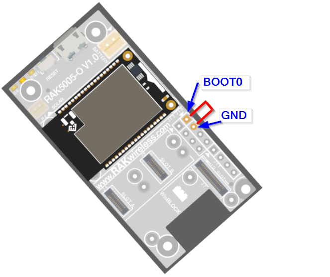

# WisBlock Quick Start Guide

<center></center>

## Content
- [Introduction](#introduction)    
- [Safety information](#safety-information)    
- [Hardware Setup](#hardware-setup)
- [Arduino IDE BSP Installation](#arduino-ide-bsp-installation)
- [Load Examples](#load-examples)

## Introduction

WisBlock is an amazing product built by RAK company for IoT industry. It can build circuits like building blocks quickly to realize your idea, and through high-speed connectors and fasteners interconnection, it can directly compose the reliable industrial products.

WisBlock consists of WisBlock Base, WisBlock Core, WisBlock Sensor, and WisBlock IO.

RAK11200 is the WisBlock Core board which consists of ESP32 Wrover. It supports WiFi and BLE functions, and supply a rich resource MCU so that you can program it if you want.

WisBlock is not only a functional test capable product in product development verification stage, but also industrial products oriented to mass production. It uses a high-speed connector to ensure the integrity of the signal. At the same time, it is equipped with fastening screw, which can be used in vibration environment. And WisBlock can be used reliably in various civil and industrial scenarios through rigorous reliability tests.

WisBlock uses a compact stacked hardware design, which integrates various computing, connecting and sensor circuits in the size of 60*30mm. The compact size makes it easy for users to build in various customized housings to achieve complete products. RAK also have a series of housings for WisBlock modules, which can meet the requirements of various protection levels.

More details about WisBlock hardware, please have a look at the document:

https://docs.rakwireless.com/Product-Categories/WisBlock/

## Safety information

Please read the following items carefully so that WisBlock can be used safely.

### Hardware

1) Please use WisBlock according to its hardware specification, including the power supply, the temperature of using, the battery, and so on.

2) Don't submerge WisBlock in liquids, and don't place WisBlock where water can reach.

3) Don't power WisBlock using other power sources which RAK hasn't suggested.


### Software

1)  There is already a bootloader in every WisBlock core board MCU when you receive the device, so that you needn't to flash the bootloader again. Normally, you only need to use it directly or upload new code into it through Arduino IDE. If you accidentally erase the bootloader, please contact with us on RAK forum: forum.rakwireless.com.

2) Please don't unplug any hardware connector when you are uploading code into it, otherwise WisBlock may become unresponsive.


## Hardware Setup


The RAK5005-O board offers several GPIO's on solder pads or on the WisBlock Sensor or WisBlock IO modules. These GPIO's are named IO1 to IO6 and SW1. These GPIO's are connected to GPIO's of the RAK11200 module.    


### WisBlock Core board --- RAK11200

RAK11200 is the WisBlock Core board, because the MCU stay on this board.

<center></center>
<center></center>

RAK11200 consists of an Espressif ESP32 Wrover module. The final Arduino  code will be uploaded into ESP32 actually. This core board supports BLE and WiFi features. You can connect it with RAK5005-O base board with slot, and program it through the USB interface on RAK5005-O through Arduino IDE.

https://docs.rakwireless.com/Product-Categories/WisBlock/RAK11200/Datasheet/#overview

<center></center>  

The GPIO assignments are defined in the RAK11200 variant.h file of the Arduino BSP.   

**RAK5005-O GPIO mapping to RAK11200 GPIO ports**
 * RAK5005-O <->  ESP32
 * IO1       <->  Arduino GPIO number 14
 * IO2       <->  Arduino GPIO number 27
 * IO3       <->  Arduino GPIO number 26
 * IO4       <->  Arduino GPIO number 23
 * IO5       <->  Arduino GPIO number 13
 * IO6       <->  Arduino GPIO number 22
 * SW1       <->  Arduino GPIO number 34
 * A0        <->  Arduino GPIO number 36
 * A1        <->  Arduino GPIO number 39
 * SPI_CS    <->  Arduino GPIO number 32 
 * LED1      <->  Arduino GPIO number 12 
 * LED2      <->  Arduino GPIO number 2 

**Defined names from variant.h**  
```cpp
#define WB_IO1 14
#define WB_IO2 27
#define WB_IO3 26
#define WB_IO4 23
#define WB_IO5 13
#define WB_IO6 22
#define WB_SW1 34
#define WB_A0 36
#define WB_A1 39
#define WB_CS 32
#define WB_LED1 12   
#define WB_LED2 2
```

## Arduino IDE BSP Installation

You can use Arduino IDE for WisBlock coding and programming.

The RAK11200 is included in the RAKwireless Arduino BSP.       
You can find the installation instructions in our [RAKwireless Arduino BSP](https://github.com/RAKWireless/RAKwireless-Arduino-BSP-Index) repository.


### Load Examples

## IMPORTANT NOTE
Different to other ESP32 boards, the RAK11200 needs to be put _**manually**_ into _**download mode**_. If you do not force the RAK11200 _**download mode**_, you cannot upload your sketch from Arduino IDE (or PlatformIO).  
  
To force the RAK11200 into _**download mode**_ you need to connect the pin _**BOOT0**_ on the WisBlock Base RAK5005-O to _**GND**_ and push the reset button.    
The _**BOOT0**_ pin is on the J10 pin header, the _**GND**_ pin is next to it.  
  



RAK has supplied many examples source code on Github for WisBlock:

- [Examples](/examples/)    
    - [Common to all WisBlock Cores](/examples/common/)
        - [Sensors Modules](/examples/common/sensors/)
            - [RAK1901_Temperature&Humidity_SHTC3](/examples/common/sensors/RAK1901_Temperature_Humidity_SHTC3/)
            - [RAK1902_Pressure_LPS22HB](/examples/common/sensors/RAK1902_Pressure_LPS22HB/)
            - [RAK1903_Optical_OPT3001](/examples/common/sensors/RAK1903_Optical_OPT3001/)
            - [RAK1904_Accelerate_LIS3DH](/examples/common/sensors/RAK1904_Accelerate_LIS3DH/)
            - [RAK1906_Environment_BME680](/examples/common/sensors/RAK1906_Environment_BEM680/)
            - [RAK1910_GPS_UBLOX7](/examples/common/sensors/RAK1910_GPS_UBLOX7/)
            - [RAK1920_MikroBUS_Temperature_TMP102](/examples/common/sensors/RAK1920_MikroBUS_Temperature_TMP102/)
            - [RAK1920_QWIIC_AirQuality_SGP30](/examples/common/sensors/RAK1920_QWIIC_AirQuality_SGP30/)
            - [RAK1920_Grove_PIR_AS312](/examples/common/sensors/RAK1920_Grove_PIR_AS312/)
            - [RAK12003_FIR_MLX90632](/examples/common/sensors/RAK12003_FIR_MLX90632/)
            - [RAK12500_GPS_ZOE-M8Q](/examples/common/sensors/RAK12500_GPS_ZOE-M8Q/)
            - [RAK15000_EEPROM_AT24C02](/examples/common/sensors/RAK15000_EEPROM_AT24C02/)     
            - [RAK15001_Flash_GD25Q16C](/examples/common/sensors/RAK15001_Flash_GD25Q16C/)     
            - [RAK19002_Boost_TPS61046](/examples/common/sensors/RAK19002_Boost_TPS61046/)     
        - [IO Modules](/examples/IO/)
            - [RAK1921_OLED_SSD1306](/examples/common/IO/RAK1921_OLED_SSD1306/)
            - [RAK1921_Jumping_Ball_SSD1306](/examples/common/IO/RAK1921_Jumping_Ball_SSD1306/)
            - [RAK1921_Moving_Logo_SSD1306](/examples/common/IO/RAK1921_Moving_Logo_SSD1306/)
            - [RAK14000-Epaper-Monochrome](/examples/common/IO/RAK14000-Epaper-Monochrome/)
            - [RAK14000-Epaper-TriColor](/examples/common/IO/RAK14000-Epaper-Monochrome/)
        - [Communications](/examples/common/communications/)
            - [Cellular](/examples/common/communications/Cellular/)
                - [BG77_Unvarnished_Transmission](/examples/common/communications/Cellular/BG77_Unvarnished_Transmission)
                - [Cellular_Ping](/examples/common/communications/Cellular/Cellular_Ping)
                - [Hologram_Tcp](/examples/common/communications/Cellular/Hologram_Tcp)
                - [Hologram_Ping_LTE](/examples/common/communications/Cellular/Hologram_Ping_LTE)
    - [RAK11200 Examples](/examples/RAK11200/) 
        - [RAK11200 Sensors](/examples/RAK11200/sensors/)
            - [RAK18001_Buzzer](/examples/RAK11200/sensors/RAK18001_Buzzer/)
        - [RAK11200 IO](/examples/RAK11200/IO/)
            - [RAK5802_RS485](/examples/RAK11200/IO/RAK5802_RS485/)
            - [RAK5801_4-20mA](/examples/RAK11200/IO/RAK5801_4-20mA/)
            - [RAK5811_0-5V](/examples/RAK11200/IO/RAK5811_0-5V/)
            - [RAK18000_Stereo](/examples/RAK11200/IO/RAK18000_Stereo/)
        - [RAK11200 Communications](/examples/RAK11200/communications/)
            - [BLE](/examples/RAK11200/communications/BLE/)
                - [ble_server](/examples/RAK11200/communications/BLE/ble_server/)
                - [ble_uart](/examples/RAK11200/communications/BLE/ble_uart/)
            - [WiFi](/examples/RAK11200/communications/WIFI/)
                - [WiFiAccessPoint](/examples/RAK11200/communications/WIFI/WiFiAccessPoint/)
                - [WiFiClient](/examples/RAK11200/communications/WIFI/WiFiClient/)
        - [RAK11200 Power](/examples/RAK11200/power/)
            - [RAK11200_Battery_Level](/examples/RAK11200/power/RAK11200_Battery_Level_Detect/)
        - [RAK11200 Solutions](/examples/RAK11200/solutions/)
            - [Weather Display](/examples/RAK11200/solutions/weather_display/)
            - [mqtt_subscribe_publish](/examples/RAK11200/solutions/mqtt_subscribe_publish/)
    
----
